🧠 Unsupervised Learning — From Basics to Advanced
> **No labels. No predefined answers. Just data — and the patterns hidden inside it.**
A practical, theory-first Jupyter Notebook that takes you from the foundations of Unsupervised Machine Learning to advanced techniques for clustering, dimensionality reduction, visualization, and anomaly detection.
Perfect for ML learners, interview preparation, revision, and building a strong unsupervised-learning foundation.
---
🚀 What You'll Learn
This notebook explores the major families of unsupervised learning:
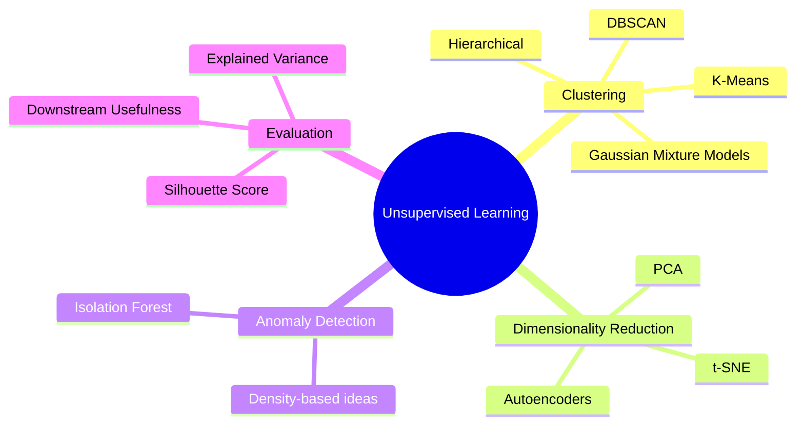
🎯 Core Question
Unlike supervised learning:
```text
Supervised Learning
        │
        ▼
   Data + Labels
        │
        ▼
 Learn X → y
        │
        ▼
 Make predictions
```
Unsupervised learning starts with:
```text
Unsupervised Learning
        │
        ▼
      Data X
        │
        ▼
 Discover hidden structure
        │
        ├──► Groups
        ├──► Representations
        ├──► Densities
        └──► Anomalies
```
The notebook emphasizes that there is no ground-truth label to directly verify the discovered structure, so evaluation uses internal metrics and/or downstream usefulness.
---
🗺️ Learning Roadmap
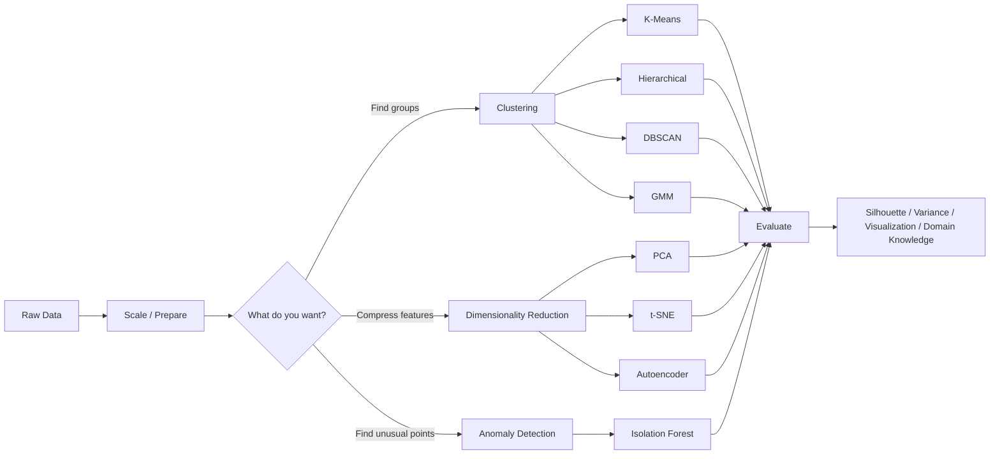
---
📚 Topics Covered
1. 🔵 K-Means Clustering
Learn how K-Means partitions data into `K` clusters by minimizing within-cluster variation.
Core idea
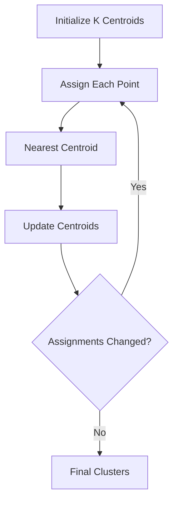
Key concepts
Centroids
Cluster assignment
Lloyd's algorithm
K-Means++
Inertia
`n_init`
Local optimum
Silhouette score
Why K-Means struggles with non-convex clusters
Important limitation
K-Means works best when clusters are approximately spherical/compact. It can fail on interleaved structures such as the classic moons dataset.
---
2. 🌳 Hierarchical / Agglomerative Clustering
A bottom-up clustering approach that starts with every point as its own cluster and repeatedly merges the closest clusters.
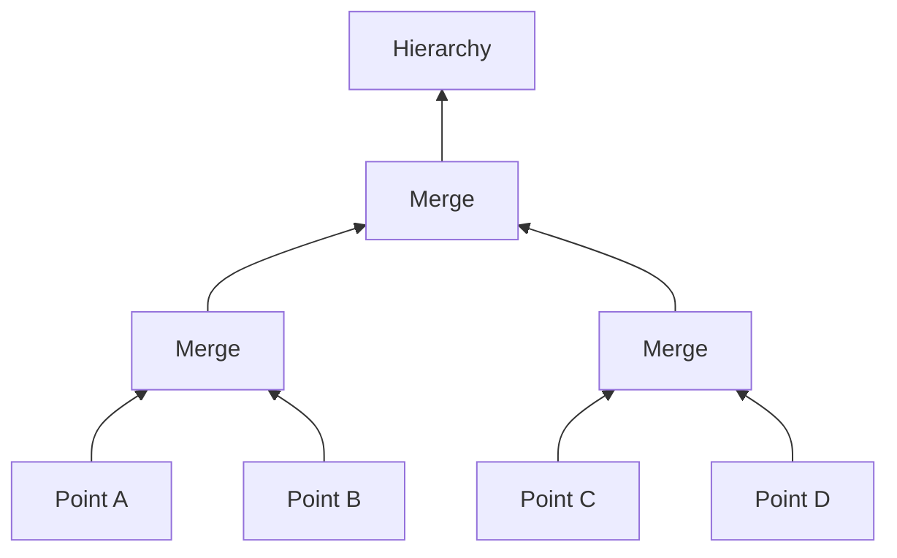
Linkage methods
Linkage	Main idea
Single	Minimum pairwise distance
Complete	Maximum pairwise distance
Average	Mean pairwise distance
Ward	Minimize increase in within-cluster variance
🔑 Visualization
The complete merge history can be represented using a dendrogram, where cutting the tree at a chosen height produces clusters.
---
3. 🟣 DBSCAN
Density-Based Spatial Clustering of Applications with Noise
DBSCAN discovers dense regions and naturally identifies sparse points as noise.
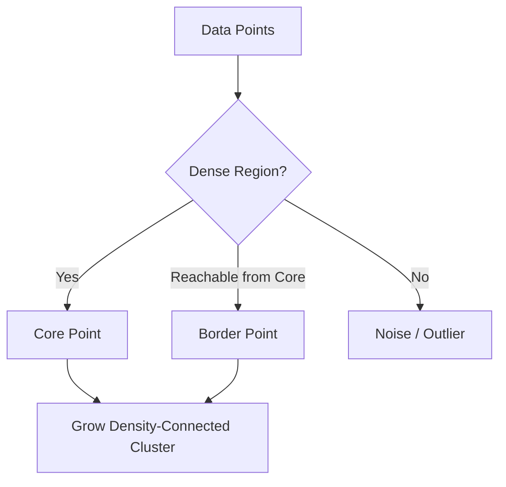
Key parameters
`eps` — neighborhood radius
`min_samples` — minimum number of nearby points for a core point
Why DBSCAN is useful
✅ Does not require choosing `K`  
✅ Can discover arbitrarily shaped clusters  
✅ Can identify noise/outliers
⚠️ Sensitive to `eps` and varying-density datasets.
---
4. 🟠 Gaussian Mixture Models (GMM)
GMM treats clustering as a probabilistic problem.
Instead of saying:
```text
Point → Cluster 1
```
GMM can say:
```text
Point
 ├── 70% → Cluster 1
 ├── 25% → Cluster 2
 └──  5% → Cluster 3
```
Expectation-Maximization
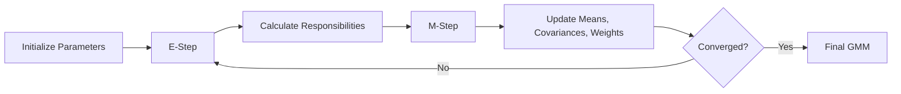
Compared with K-Means
K-Means	GMM
Hard assignments	Soft assignments
Centroid based	Probability based
Mainly spherical clusters	Can model elliptical clusters
Minimizes inertia	Maximizes likelihood
---
📉 Dimensionality Reduction
High-dimensional data can be difficult to visualize, store, or process.
The notebook covers three major approaches:
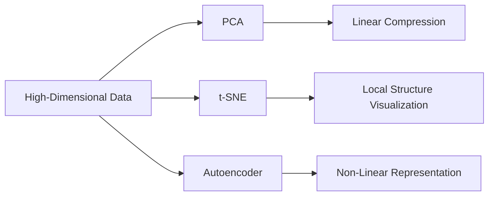
---
5. 🔷 PCA — Principal Component Analysis
PCA finds directions that capture the greatest amount of variance in the data.
PCA pipeline
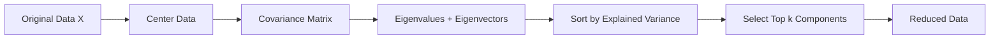
Core concepts
Centering
Covariance matrix
Eigenvectors
Eigenvalues
Principal components
Explained variance ratio
Projection into lower-dimensional space
Mental model
```text
10 features
     ↓
    PCA
     ↓
3 principal components
     ↓
Less dimensions + retained structure
```
PCA is a linear dimensionality-reduction technique.
---
6. 🟡 t-SNE
t-Distributed Stochastic Neighbor Embedding
t-SNE focuses on preserving local neighborhoods when mapping high-dimensional data into a low-dimensional space.
PCA vs t-SNE
PCA	t-SNE
Linear	Non-linear
Preserves major variance directions	Preserves local neighborhoods
Useful for feature reduction	Primarily useful for visualization
More deterministic	Can be non-deterministic
Has an inverse-transform concept in common workflows	No simple inverse transform
⚠️ Important
t-SNE is excellent for visual exploration, but distances between far-apart clusters should not automatically be interpreted as meaningful global geometry.
---
🚨 Anomaly Detection
7. 🌲 Isolation Forest
Isolation Forest follows a simple intuition:
> **Anomalies are rare and different, so random splits should isolate them quickly.**
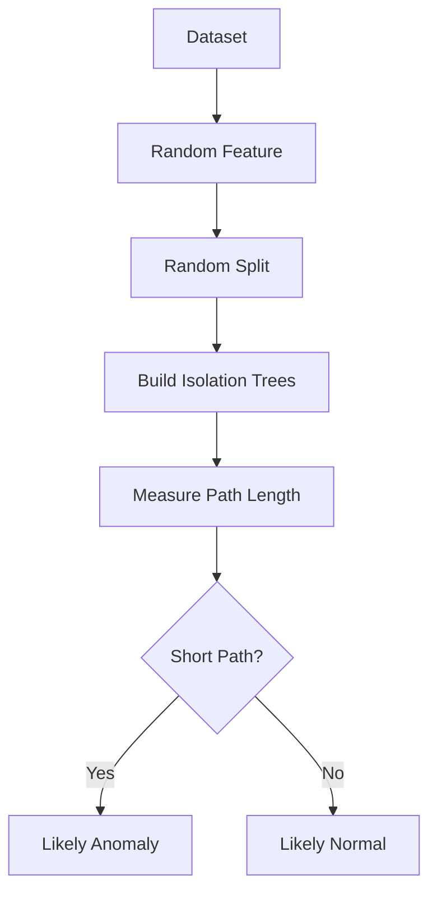
Mental model
```text
Normal point:
Random splits → takes many steps to isolate

Anomaly:
Random splits → isolated quickly
```
The notebook covers the relationship between path length and anomaly scoring.
---
🤖 Neural Unsupervised Learning
8. 🔥 Autoencoders
An autoencoder learns to reconstruct its own input.
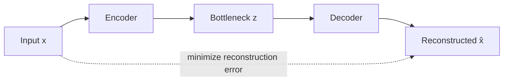
Architecture
```text
Input
  │
  ▼
Encoder
  │
  ▼
Compressed Representation
  │
  ▼
Decoder
  │
  ▼
Reconstruction
```
The bottleneck forces the network to learn a compact representation.
Key insight
A linear autoencoder trained with mean-squared reconstruction loss can recover the same principal subspace as PCA, while non-linear autoencoders can learn more complex representations.
---
📊 Evaluation Cheat Sheet
Because unsupervised learning usually has no labels, evaluation is different from supervised learning.
Useful signals
Technique	What it helps evaluate
Silhouette Score	Cluster separation and cohesion
Inertia	Within-cluster variation for K-Means
Explained Variance	Information retained by PCA
Visualization	Structure and neighborhood patterns
Downstream usefulness	Whether the representation/clusters help a later task
Domain knowledge	Whether discovered patterns actually make sense
Silhouette score
The notebook introduces the silhouette score and its range:
```text
-1 ───────── 0 ───────── +1
Bad          Mixed       Strong
clustering               separation
```
Higher values generally indicate better-separated clusters.
---
⚔️ Algorithm Selection Guide
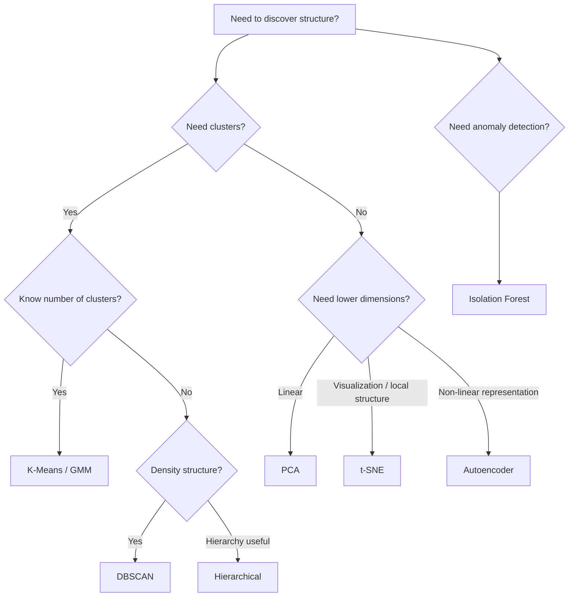
---
🧪 Tech Stack
```text
Python
│
├── NumPy
├── Pandas
├── Matplotlib
└── Scikit-learn
```
The notebook uses tools including:
`numpy`
`pandas`
`matplotlib`
`scikit-learn`
Synthetic datasets such as blobs and moons
Digits data for dimensionality-reduction exploration
---
⚙️ Getting Started
1. Clone the repository
```bash
git clone https://github.com/your-username/your-repository.git
cd your-repository
```
2. Create a virtual environment
Windows
```bash
python -m venv .venv
.venv\Scripts\activate
```
Linux / macOS
```bash
python3 -m venv .venv
source .venv/bin/activate
```
3. Install dependencies
```bash
pip install numpy pandas matplotlib scikit-learn jupyter
```
4. Launch Jupyter
```bash
jupyter notebook
```
Open:
```text
unsupervised_ml_basics_to_advanced(1).ipynb
```
---
📁 Suggested Repository Structure
```text
unsupervised-learning/
│
├── 📓 unsupervised_ml_basics_to_advanced.ipynb
├── 📄 README.md
├── 📄 requirements.txt
│
├── 📂 images/
│   ├── kmeans.png
│   ├── dbscan.png
│   ├── pca.png
│   └── tsne.png
│
└── 📂 datasets/
    └── README.md
```
---
🧠 Quick Revision Table
Algorithm	Category	Key Idea	Main Watch-Out
🔵 K-Means	Clustering	Minimize within-cluster variance	Needs `K`, spherical assumptions
🌳 Hierarchical	Clustering	Bottom-up cluster merging	Can be expensive at scale
🟣 DBSCAN	Clustering	Density-connected regions	Sensitive to `eps`, varying density
🟠 GMM	Clustering	Gaussian mixture + EM	Gaussian assumptions
🔷 PCA	Dimensionality Reduction	Preserve maximum variance	Linear only
🟡 t-SNE	Visualization	Preserve local neighborhoods	Mainly visualization
🌲 Isolation Forest	Anomaly Detection	Isolate unusual points quickly	Contamination needs consideration
🔥 Autoencoder	Dimensionality Reduction	Learn compressed representation	More data/tuning required
---
💡 The Big Picture
Think of the entire notebook like this:
```text
                         UNSUPERVISED ML
                               │
             ┌─────────────────┼─────────────────┐
             │                 │                 │
             ▼                 ▼                 ▼
        CLUSTERING          REDUCTION        ANOMALIES
             │                 │                 │
      ┌──────┼──────┐      ┌───┼────┐            │
      ▼      ▼      ▼      ▼   ▼    ▼            ▼
   K-Means  DBSCAN  GMM    PCA t-SNE AE    Isolation Forest
      │      │      │       │    │    │            │
      └──────┴──────┴───────┴────┴────┴────────────┘
                              │
                              ▼
                         FIND STRUCTURE
```
---
🎓 Learning Outcomes
After completing this notebook, you should be able to:
Understand what unsupervised learning is and why it is useful
Explain the intuition behind major clustering algorithms
Understand K-Means, Hierarchical, DBSCAN, and GMM
Explain hard vs soft clustering
Understand PCA from intuition through eigenvectors/eigenvalues
Explain why t-SNE is mainly used for visualization
Understand anomaly detection with Isolation Forest
Explain encoder → bottleneck → decoder architecture
Compare linear and non-linear dimensionality reduction
Choose an unsupervised algorithm based on the structure of a dataset
Evaluate clustering without relying on traditional accuracy
---
🏆 Interview Cheat Sheet
K-Means
Q: Why does K-Means need `K`?
A: The algorithm needs the number of clusters to determine how many centroids to initialize.
DBSCAN
Q: What is DBSCAN's biggest advantage over K-Means?
A: It does not require `K` beforehand and can discover arbitrarily shaped dense clusters while identifying noise.
GMM
Q: K-Means vs GMM?
A: K-Means makes hard cluster assignments, while GMM provides probabilistic soft assignments.
PCA
Q: What does PCA maximize?
A: The variance captured by the selected principal components.
t-SNE
Q: Is t-SNE a good general-purpose feature-reduction method?
A: Usually no. It is primarily valuable for visualizing local structure in high-dimensional data.
Isolation Forest
Q: Why are anomalies easier to detect?
A: They tend to be isolated by random partitions in fewer steps.
Autoencoder
Q: Why is the bottleneck important?
A: It forces the network to learn a compressed representation of the input.
---
🌟 Why This Repository?
This is more than a list of algorithms.
It is designed as a progressive learning path:
```text
Understand the idea
       ↓
Understand the mathematics
       ↓
Understand the algorithm
       ↓
Visualize the behavior
       ↓
Understand the limitations
       ↓
Know when to use it
```
That combination makes the notebook useful for both learning and interview revision.
---
🤝 Contributing
Found an improvement, typo, visualization idea, or a useful example?
Contributions are welcome!
```text
Fork → Improve → Commit → Pull Request
```
Ideas for future additions:
More real-world datasets
Clustering on customer data
Anomaly detection projects
UMAP
Advanced autoencoders
Model comparison experiments
Interactive visualizations
End-to-end unsupervised ML projects
---
📌 Note
This README describes the content covered in the accompanying notebook. The notebook itself is the primary learning material and contains the detailed explanations, mathematical intuition, code, and experiments.
---
⭐ If You Find This Useful
Give the repository a star ⭐ and use it as a reference while learning Unsupervised Machine Learning.
> **Learn the pattern. Understand the math. Visualize the structure. Build with ML. 🚀**
---
📜 License
Add your preferred license here, such as MIT License.
